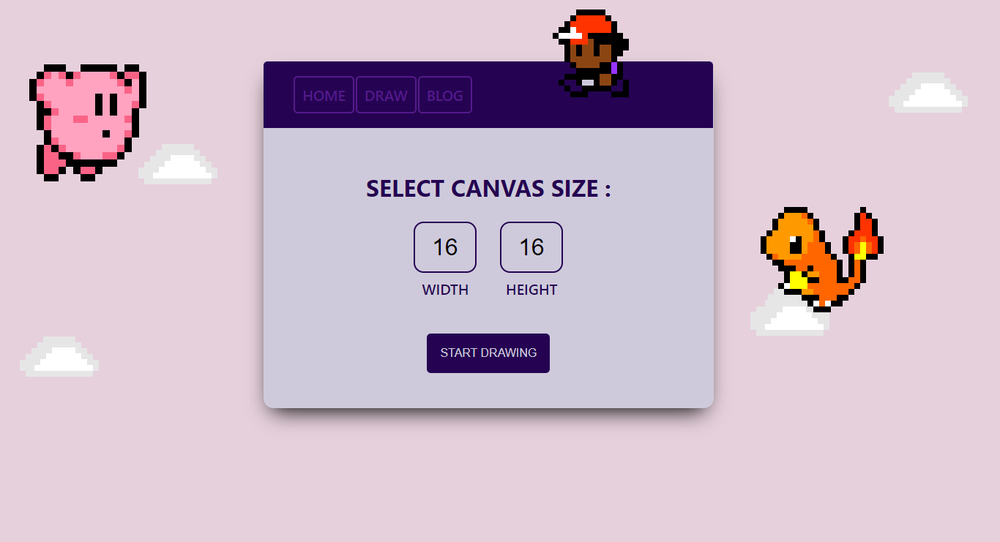
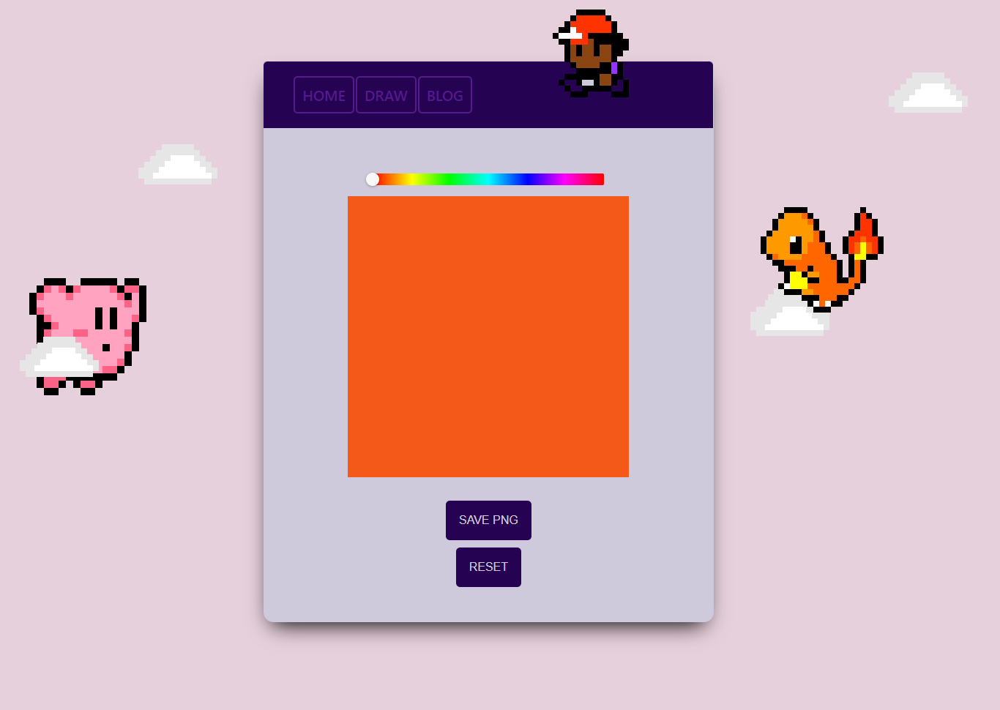

# CREATE PIXEL ART

This was a [Mintbean](https://mintbean.io/) Hackathon project.

# ABOUT

During a one-week sprint, I coded and deployed a pixel art maker.

# INSTALL REQUIREMENTS

1. Install create-react-app
2. Install react
3. Install react-color
4. Install react-component-export-image
5. Install react-router-dom
6. Install react-dom

