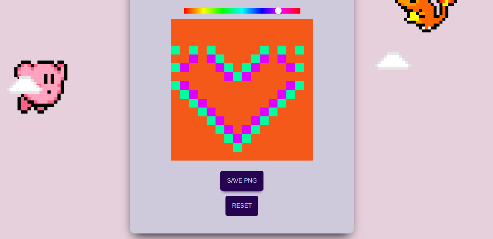

# CREATE PIXEL ART

This was a [Mintbean](https://mintbean.io/) Hackathon project.

# ABOUT

During a one-week hackathon, I coded and deployed a pixel art creator! The frontend-only challenge prompt was to build an app that lets people express their creativity in a visual format. The app had to fulfill one or both of the following requirements: 
* As a user, I can drag my mouse across the screen to make free-form lines.
* As a user, I can click areas of the screen with my mouse to fill them with a color, texture or pattern.

This was scoped as a solo hack. To view the project, visit https://create-pixel-art.scarlett-spade.repl.co/.

To follow my journey as a frontend & blockchain developer, UX/UI designer, & film student: https://twitter.com/scarlett_spade.

# INSTALL REQUIREMENTS

1. Install create-react-app
2. Install react
3. Install react-color
4. Install react-component-export-image
5. Install react-router-dom
6. Install react-dom

